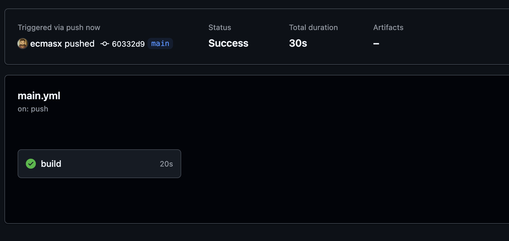

# Lucrare de laborator №8: Integrare continuă cu Github Actions

## Scopul lucrării

În cadrul acestei lucrări studenții vor învăța să configureze integrarea continuă cu ajutorul Github Actions.

## Sarcina

Crearea unei aplicații Web, scrierea testelor pentru aceasta și configurarea integrării continue cu ajutorul Github Actions pe baza containerelor.

## Execuție

1. Am creat directorul ./site
   

2. Am creat in directorul ./site urmatoarea structura:
   

3. Am creat fișierele necesare pentru aplicația web PHP:
   

4. Am creat directorul `./site/sql` cu fișierul `schema.sql` pentru crearea și popularea bazei de date:

   ```sql
   CREATE TABLE page (
       id INTEGER PRIMARY KEY AUTOINCREMENT,
       title TEXT,
       content TEXT
   );

   INSERT INTO page (title, content) VALUES ('Page 1', 'Content 1');
   INSERT INTO page (title, content) VALUES ('Page 2', 'Content 2');
   INSERT INTO page (title, content) VALUES ('Page 3', 'Content 3');
   ```

   

5. Am creat directorul `./tests` pentru testarea aplicației:

   - `testframework.php` - framework-ul simplu pentru testare
   - `tests.php` - testele pentru clasa Database și Page

6. Am creat Dockerfile pentru construirea containerului:

   ```dockerfile
   FROM php:7.4-fpm as base

   RUN apt-get update && \
       apt-get install -y sqlite3 libsqlite3-dev && \
       docker-php-ext-install pdo_sqlite

   VOLUME ["/var/www/db"]

   COPY site/sql/schema.sql /var/www/db/schema.sql

   RUN echo "prepare database" && \
       cat /var/www/db/schema.sql | sqlite3 /var/www/db/db.sqlite && \
       chmod 777 /var/www/db/db.sqlite && \
       rm -rf /var/www/db/schema.sql && \
       echo "database is ready"

   COPY site /var/www/html
   ```

7. Am configurat GitHub Actions pentru integrare continuă:

   - Am creat directorul `.github/workflows`
   - Am adăugat fișierul `main.yml` cu configurația pentru CI:

     ```yaml
     name: CI

     on:
       push:
         branches:
           - main

     jobs:
       build:
         runs-on: ubuntu-latest
         steps:
           - name: Checkout
             uses: actions/checkout@v4
           - name: Build the Docker image
             run: docker build -t containers08 .
           - name: Create `container`
             run: docker create --name container --volume database:/var/www/db containers08
           - name: Copy tests to the container
             run: docker cp ./tests container:/var/www/html
           - name: Up the container
             run: docker start container
           - name: Run tests
             run: docker exec container php /var/www/html/tests/tests.php
           - name: Stop the container
             run: docker stop container
           - name: Remove the container
             run: docker rm container
     ```

8. Structura finală a proiectului:

   ```bash
   containers08/
   ├── .github/
   │   └── workflows/
   │       └── main.yml
   ├── images/
   ├── site/
   │   ├── modules/
   │   │   ├── database.php
   │   │   └── page.php
   │   ├── templates/
   │   │   └── index.tpl
   │   ├── styles/
   │   │   └── style.css
   │   ├── sql/
   │   │   └── schema.sql
   │   ├── data/
   │   ├── config.php
   │   └── index.php
   ├── tests/
   │   ├── testframework.php
   │   └── tests.php
   ├── Dockerfile
   └── readme.md
   ```

9. Testarea GitHub Actions:
   După trimiterea codului în repositoriul GitHub, GitHub Actions va rula automat testele definite în workflow. Putem verifica rezultatele în fila Actions din repositoriu.

   

## Răspunsuri la întrebări

1. **Ce este integrarea continuă?**

   Integrarea continuă (CI) este o practică de dezvoltare software în care membrii echipei integrează codul în mod frecvent, de obicei de mai multe ori pe zi. Fiecare integrare este verificată printr-o construire automată (inclusiv teste) pentru a detecta erorile cât mai repede posibil. Această practică reduce problemele de integrare și permite dezvoltarea software-ului de calitate mai rapid.

2. **Pentru ce sunt necesare testele unitare? Cât de des trebuie să fie executate?**

   Testele unitare sunt necesare pentru:

   - Verificarea corectitudinii funcționalității individuale a codului
   - Detectarea rapidă a erorilor
   - Facilitarea modificărilor codului (refactorizare) prin asigurarea că funcționalitatea existentă nu este afectată
   - Documentarea comportamentului așteptat al codului

   Testele unitare trebuie executate cât mai des posibil, de preferință:

   - La fiecare schimbare a codului (commit)
   - Înainte de integrarea codului în ramura principală (pull request)
   - În timpul construcției automate în procesul de CI/CD

   Ideea este de a prinde erorile cât mai devreme, când sunt mai ușor și mai ieftin de remediat.

3. **Care modificări trebuie făcute în fișierul .github/workflows/main.yml pentru a rula testele la fiecare solicitare de trage (Pull Request)?**

   Pentru a rula testele la fiecare Pull Request, trebuie să modificăm secțiunea `on` din fișierul main.yml astfel:

   ```yaml
   on:
     push:
       branches:
         - main
     pull_request:
       branches:
         - main
   ```

   Această modificare va declanșa workflow-ul atât la push-uri pe ramura main, cât și la deschiderea sau actualizarea unui Pull Request către main.

4. **Ce trebuie adăugat în fișierul .github/workflows/main.yml pentru a șterge imaginile create după testare?**

   Pentru a șterge imaginile Docker create după testare, trebuie să adăugăm următorii pași la sfârșitul job-ului:

   ```yaml
   - name: Remove Docker images
     run: docker rmi containers08 --force
   - name: Prune Docker system
     run: docker system prune -af
   ```

   Primul pas va șterge imaginea containers08 creată în timpul testării, iar al doilea pas va curăța resursele neutilizate din sistemul Docker (imagini, containere, volume, rețele).

## Concluzii

În cadrul acestei lucrări de laborator, am creat o aplicație web PHP simplă, am scris teste pentru a verifica funcționalitatea acesteia și am configurat un pipeline de integrare continuă folosind GitHub Actions. Am învățat cum să utilizăm containere Docker pentru a izola mediul de testare și am configurat un workflow automat care construiește, testează și curăță aplicația.

Integrarea continuă cu GitHub Actions oferă numeroase avantaje:

- Automatizarea procesului de testare
- Detectarea timpurie a erorilor
- Asigurarea calității codului
- Feedback rapid pentru dezvoltatori
- Îmbunătățirea procesului de colaborare în echipă

Toate aceste practici contribuie la dezvoltarea unui software mai robust și la un proces de dezvoltare mai eficient.
